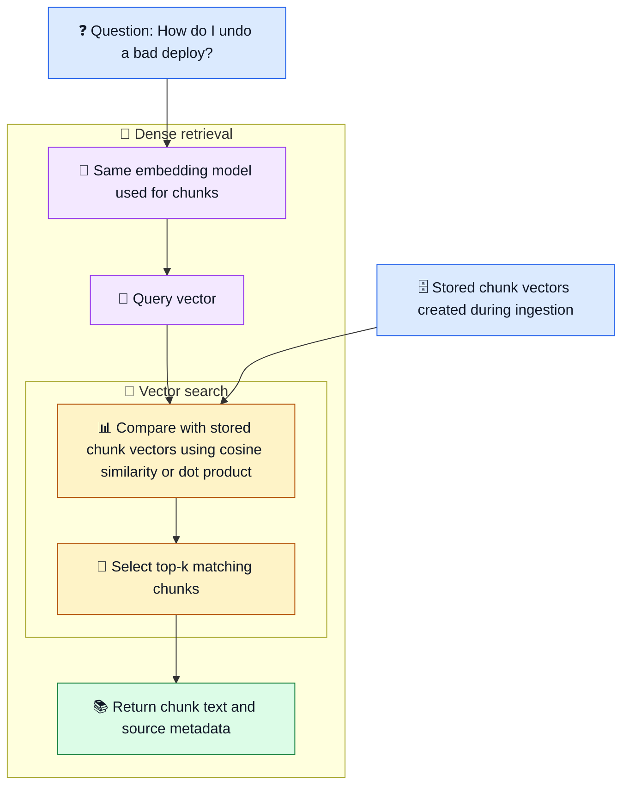

# 🔎 Retrieval Methods

📚 **Documents** → 🔎 **Search method** → 🎯 **Top matches** → 🤖 **Answer with context**

Read [RAG fundamentals](00_start_here_rag_fundamentals.md) first. This note
explains common retrieval methods before the model writes an answer.

## 🎯 Why retrieval matters

Retrieval decides which chunks reach the answer step.

If retrieval misses the rollback procedure, the chat model cannot safely answer a
rollback question. If retrieval sends noisy chunks, the answer may include
unrelated details.

```text
Question: "How do I roll back staging?"
          ↓
Retriever finds matching chunks
          ↓
Chat model answers from those chunks
```

Retrieval is not the same as generation. Retrieval finds evidence. Generation
turns evidence into an answer.

## 1. 🔤 Sparse retrieval with BM25

**Sparse retrieval** searches using exact words or near-exact word matches. A
common method is **BM25**, a keyword scoring method used by many search systems.

```text
Question: "CrashLoopBackOff logs"
          ↓
BM25 prefers chunks containing words like "CrashLoopBackOff" and "logs"
```

BM25 scores text using signals like:

- Whether the query words appear in the chunk.
- How often those words appear.
- How rare those words are across the document set.
- How long the chunk is.

### ✅ Good for

- Exact names: `CrashLoopBackOff`, `kubectl`, `deployment/api`.
- Error codes, service names, ticket IDs, command flags, and namespaces.
- Cases where users know the exact term in the document.

### ⚠️ Limits

- It can miss related wording.
- "Pods cannot schedule" may not match a chunk that says "Pending pods" well.
- It does not understand meaning beyond the words it can match.

## 2. 🔢 Dense retrieval

**Dense retrieval** uses embeddings. An embedding is a list of numbers that
represents the meaning of text.

Dense retrieval includes creating the query vector and searching stored chunk
vectors. Vector search is part of this process, not a later retrieval method.



- 🔢 **Embedding stage:** converts text into vectors.
- 🎯 **Search stage:** scores vector matches and selects the top-k chunks.
  Cosine similarity or dot product is a scoring function within this step.
  Use the function expected by the embedding model; our demo uses cosine similarity.
- 📚 **Result stage:** returns the selected text and metadata for the answer prompt.

Dense retrieval can find related ideas even when the words differ.

Example:

| Question wording | Useful document wording |
| --- | --- |
| undo a bad deploy | rollback procedure |
| pods cannot schedule | pods Pending |
| app keeps restarting | CrashLoopBackOff |

### ✅ Good for

- Natural language questions.
- Runbooks where users ask in different words.
- Incident notes that describe the same issue in several ways.

### ⚠️ Limits

- It may miss exact strings that matter, such as `--timeout=120s`.
- It can retrieve text that feels related but does not answer the question.
- It needs an embedding model and a vector store or vector index.

## 3. 📍 Vector search

**Vector search** is the search step used by dense retrieval.

The system compares the question vector with stored chunk vectors and returns
the closest matches.

```text
Saved chunk vectors:
[rollback chunk vector]
[incident chunk vector]
[pod troubleshooting vector]

Question vector → compare → top-k closest chunks
```

In our local demo, Python compares every stored vector in a JSON file. That is
simple and useful for learning.

In larger systems, a vector database or vector index is used so search stays
fast when there are many chunks.

### ✅ Good for

- Searching many embedded chunks.
- Finding meaning-based matches.
- Returning top-k chunks for the RAG prompt.

### ⚠️ Limits

- A close vector score is not proof that the chunk answers the question.
- Vector search depends on chunk quality.
- Rebuild vectors after changing documents, chunk settings, or embedding model.

## 4. 🔀 Hybrid search

**Hybrid search** combines sparse search and dense search.

```text
Question
  ├─ BM25 finds exact keyword matches
  └─ Dense retrieval finds meaning matches
          ↓
Combine and rank results
```

This is useful because DevOps questions often need both exact terms and meaning.

Example:

```text
"Why did api pods stay Pending in EKS?"
```

- BM25 helps match `api`, `Pending`, and `EKS`.
- Dense retrieval helps match related text about unschedulable pods, node
  capacity, and autoscaling.

### ✅ Good for

- Mixed queries with exact terms and plain language.
- Production RAG systems where missing exact identifiers is risky.
- DevOps docs with commands, service names, error names, and explanations.

### ⚠️ Limits

- It needs extra ranking logic.
- BM25 and dense scores use different scales, so they cannot be blindly compared.
- It may still need re-ranking to put the best evidence first.

## 📊 Method comparison

| Method | What it matches | Strong when | Weak when |
| --- | --- | --- | --- |
| Sparse / BM25 | Exact words and terms | The query contains error names, commands, or service IDs | The user asks with different wording |
| Dense | Meaning through embeddings | The query is natural language | Exact flags, IDs, or rare terms matter |
| Vector search | Closest stored vectors | You need fast meaning-based lookup | Chunks or embeddings are poor |
| Hybrid | Keywords plus meaning | DevOps questions mix exact terms and intent | Ranking is not tuned |

## 🛠️ How this fits our current project

Our current local RAG demo uses dense retrieval:

```text
Chunks → Ollama embeddings → JSON vector store
Question → query embedding → cosine similarity → top-k chunks
```

It does **not** implement BM25 or hybrid search yet.

A future hands-on lab could compare:

- BM25 only: good for exact Kubernetes terms.
- Dense only: good for natural wording.
- Hybrid: useful when both matter.

## 🧰 Practical DevOps examples

| User question | Retrieval method to try first | Why |
| --- | --- | --- |
| What should I inspect for `CrashLoopBackOff`? | BM25 or hybrid | Exact error name matters |
| How do I undo a failed staging release? | Dense or hybrid | "Undo" should match rollback |
| Which command checks rollout status? | BM25 | Exact command text matters |
| Why were pods unschedulable during the spike? | Dense or hybrid | Related wording may appear across incident notes |

## 📝 What to remember

| Concept | Depth required |
| --- | --- |
| Sparse/BM25 exact-term matching | Understand well |
| Dense retrieval with embeddings | Understand well |
| Vector search as the lookup over embeddings | Understand well |
| Hybrid search combining sparse and dense results | Understand well |
| Score merging, vector index internals, and ranking formulas | Basic awareness |

✅ Start simple. Use BM25 when exact terms matter, dense retrieval when meaning
matters, and hybrid search when a real system needs both.
