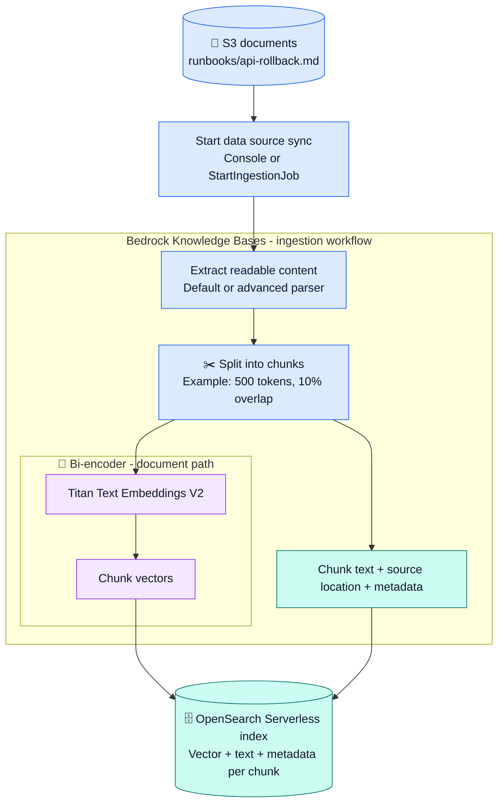
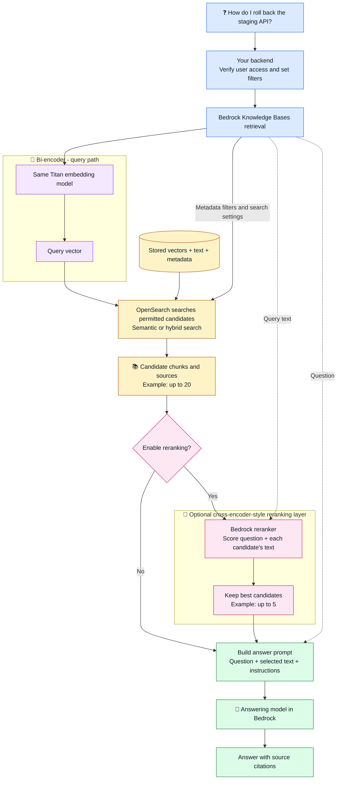

# ☁️ AWS RAG: S3, Titan, and OpenSearch

Read [RAG fundamentals](00_start_here_rag_fundamentals.md) first.
This is a design guide, not a deployed project. Examples use fictional runbooks.
AWS options checked on **2026-09-21**; check linked documentation before setup.

We use **Amazon Bedrock Knowledge Bases with an S3 data source and an
OpenSearch Serverless vector store**. This is the configurable vector-store
path, not a guide to every Bedrock knowledge base type.
The embedding model's name is **Amazon Titan**, not Titen.

## 🧩 What each component does

| Component | Role in this design | Local course equivalent |
| --- | --- | --- |
| Amazon S3 | Keeps original runbooks and metadata files | `data/` folder |
| Bedrock Knowledge Bases | Coordinates ingestion, embedding, storage, and retrieval | Pipeline logic in Python |
| Titan Text Embeddings V2 | Converts chunks and questions into vectors | Embedding model run by Ollama |
| OpenSearch Serverless | Stores and searches vectors, chunk text, and metadata | `vectors.json` plus search code |
| Optional Bedrock reranker | Scores question/chunk pairs again | Optional cross-encoder layer |
| Answering model in Bedrock | Writes the answer from selected evidence | Chat model run by Ollama |
| Your backend | Authenticates users and calls Bedrock | Application around the pipeline |

Titan embeddings do not write the final answer. OpenSearch does not host Titan.
Bedrock calls the models and coordinates the workflow. Its quick-create option
can provision the OpenSearch collection and index.
[AWS setup guide](https://docs.aws.amazon.com/bedrock/latest/userguide/knowledge-base-create.html)

## 📥 Prepare knowledge



Uploading a file to S3 alone does not complete indexing. Start a sync and check
its result. Changed content or metadata is processed again during sync.
For automatic updates, your team can build a scheduled or event-driven sync
workflow, with retries and batching. Check document deletion behavior too.
[AWS sync behavior](https://docs.aws.amazon.com/bedrock/latest/userguide/kb-data-source-sync-ingest.html)

Example S3 layout; `example-rag-docs` is a placeholder bucket name:

```text
s3://example-rag-docs/runbooks/
  api-rollback.md
  api-rollback.md.metadata.json
```

The sidecar metadata file can contain:

```json
{
  "metadataAttributes": {
    "service": "api",
    "environment": "staging",
    "team": "platform"
  }
}
```

This labels the document for retrieval filters. It is not an embedding and does
not grant access by itself. The backend must derive any permission filters from
the authenticated user, not trust a user-supplied team name.
[AWS metadata filtering](https://docs.aws.amazon.com/bedrock/latest/userguide/kb-test-config.html)

## 🔎 Answer a question



This diagram shows `RetrieveAndGenerate`: Bedrock retrieves evidence and calls
the answering model. Use `Retrieve` when your backend only wants matching chunks
and will build the prompt or call the answering model itself.
[AWS retrieval API](https://docs.aws.amazon.com/bedrock/latest/APIReference/API_agent-runtime_Retrieve.html)

## ⚙️ Setup choices that matter

### S3 and document parsing

- Use an S3 prefix such as `runbooks/` to limit the source scope.
- Keep original documents readable and current; enable S3 versioning if you need
  source history. Versioning does not roll back the vector index automatically.
- The default parser extracts text. For difficult PDFs, tables, or figures,
  evaluate Bedrock Data Automation or a supported model-based parser.
- Advanced parsing adds cost. Check extracted content before changing retrieval.
  Titan Text Embeddings consumes text; choosing it does not turn raw images into
  image embeddings.

[AWS parsing options](https://docs.aws.amazon.com/bedrock/latest/userguide/kb-advanced-parsing.html)

### Chunking

| Option | What chooses boundaries | Useful settings and example |
| --- | --- | --- |
| Default | Service code honors sentence boundaries | About 300 tokens per chunk |
| Fixed-size | Code rules | Maximum tokens and overlap percentage; try 500 and 10% for a runbook experiment |
| Hierarchical | Code rules build parent/child chunks | Parent/child token limits and overlap tokens; search children, return broader parents |
| Semantic | Embedding comparisons plus code | Maximum tokens, sentence buffer, and breakpoint percentile; extra embedding work |
| No chunking | One file becomes one chunk | Useful for already-split small files |

A token is a piece of text a model reads, not a character. These settings differ
from our local character-count splitter. Semantic boundary selection happens
before final chunk embeddings. It is not an agent deciding where to split.
Hierarchical retrieval can return fewer results after combining shared parents.
[AWS chunking behavior](https://docs.aws.amazon.com/bedrock/latest/userguide/kb-chunking.html)

### Titan and OpenSearch

- Select Titan Text Embeddings V2: `amazon.titan-embed-text-v2:0`.
  It supports 1,024, 512, or 256 dimensions: numbers per vector, not chunk size.
- Match the index dimension to the selected embedding dimension. Use the same
  embedding configuration for documents and questions. Model or dimension
  changes require a compatible index and re-embedding the corpus.
- Titan is a managed model API; no model server is needed in your application.

[AWS Titan documentation](https://docs.aws.amazon.com/bedrock/latest/userguide/titan-embedding-models.html)

An OpenSearch **collection** holds indexes. The vector **index** defines vector,
text, and metadata fields. Bedrock's mappings must match those field names.
For a manually created Serverless index, follow AWS's `faiss` engine setup.
Hybrid search also needs the supported text field configuration.

**Do not label every AWS search as cosine similarity.** The index has a distance
metric; AWS's setup guide recommends Euclidean distance for floating-point
vectors. Search scores are not confidence percentages. Unlike our Python demo,
an indexed search need not compare every stored vector in a simple loop.
[AWS vector-store setup](https://docs.aws.amazon.com/bedrock/latest/userguide/knowledge-base-setup.html)

### Retrieval and generation controls

| Control | Meaning |
| --- | --- |
| `numberOfResults` | Maximum candidate chunks; example: 20 |
| `overrideSearchType` | `SEMANTIC` for vectors; `HYBRID` for vectors plus text where supported |
| Metadata `filter` | Restrict candidates, for example to staging runbooks |
| Reranking | Optional second scoring pass; see below |
| Generate responses | Include an answering model instead of inspecting retrieval alone |
| Prompt template | Tell the model how to use evidence and cite sources |
| Output token limit | Limits answer length; distinct from chunk size |
| Temperature | Controls sampling variation, not factual correctness |
| Query decomposition | Optional splitting of complex questions into searches; adds work |
| Guardrail configuration | Optional content controls; not document authorization |

Test `HYBRID` for exact terms such as `CrashLoopBackOff`; compare against
`SEMANTIC` using the same questions. Console settings must also be passed by your
application where required; a console test is not your application's configuration.
[AWS query configuration](https://docs.aws.amazon.com/bedrock/latest/userguide/kb-test-config.html)

## 🧠 Can we use a cross-encoder?

Yes: enable a managed **reranker** after retrieval. This fills the cross-encoder
layer in our course diagram. It scores query/document pairs; it does not replace
Titan or store another set of chunk embeddings. Internal architecture depends
on the selected model, so do not assume all rerankers are identical.

AWS lists **Amazon Rerank 1.0** (`amazon.rerank-v1:0`) and **Cohere Rerank 3.5**
(`cohere.rerank-v3-5:0`). Check the Region before selecting one; availability is
not the same everywhere. For example, the checked AWS table lists Cohere but
not Amazon Rerank in `us-east-1`.
[AWS reranker availability](https://docs.aws.amazon.com/bedrock/latest/userguide/rerank-supported.html)

In the console, open **Configurations → Reranking** and select a supported model.
For API calls, set `vectorSearchConfiguration.rerankingConfiguration` with a
Bedrock reranking model configuration. `numberOfRerankedResults` controls the
returned count. Example: retrieve 20, rerank, return 5. You can also choose which
metadata the reranker sees. This is separate from retrieval permission filters.
[AWS reranking configuration](https://docs.aws.amazon.com/bedrock/latest/APIReference/API_agent-runtime_VectorSearchBedrockRerankingConfiguration.html)

Allow the required reranking/model permissions. Third-party models can also
require Marketplace subscription permissions during enablement.
[AWS reranking permissions](https://docs.aws.amazon.com/bedrock/latest/userguide/rerank-prereq.html)

Reranking adds model cost and latency. Check whether it improves your test set.
It cannot recover a useful document missing from the candidate set.

## 🛠️ What is managed, and what remains yours?

**Managed infrastructure does not mean a fully managed application.**

| Layer | AWS manages | Your team manages |
| --- | --- | --- |
| S3 | Storage infrastructure | Content, bucket policy, retention, versioning |
| Knowledge Bases | Execution of configured ingestion/retrieval | Source scope, sync triggers, settings, failed-job follow-up |
| Titan, reranker, answering model | Hosted model execution | Model choice, access, quotas, quality checks |
| OpenSearch Serverless | Server fleet and service scaling | Index design, access/network policies, capacity limits, costs |
| IAM and KMS | Identity/key service infrastructure | Least-privilege roles and encryption-key policies |
| Backend | Runtime infrastructure if using Lambda | Login, authorization, request settings, retries, user experience |

IAM means Identity and Access Management; KMS means Key Management Service.
The Bedrock service role needs scoped S3, model, vector-store, and applicable KMS
access. The backend caller has a separate role. OpenSearch Serverless also has
data-access and network policies; an IAM grant alone is not the whole setup.
For private networking, allow the required Bedrock service path and application
access explicitly. Do not make a collection public just to clear a permission error.
[AWS storage permissions](https://docs.aws.amazon.com/bedrock/latest/userguide/knowledge-base-setup.html),
[AWS encryption](https://docs.aws.amazon.com/bedrock/latest/userguide/encryption-kb.html)

## ✅ Build and check a small setup

1. Choose a Region supporting Titan, OpenSearch Serverless, the answering model,
   and any reranker. Upload a few fictional runbooks and metadata files to S3.
2. Create the Knowledge Base and scoped service role. Connect the S3 prefix.
3. Choose parsing/chunking, Titan V2 dimensions, and an OpenSearch vector store.
   Use quick-create or supply a compatible collection, index, and field mappings.
4. Start sync. Inspect ingestion failures before testing questions.
5. Use `Retrieve` first. Check chunk text, source locations, and metadata filters.
6. Compare semantic/hybrid retrieval, then reranking on/off. Only then test answers.
7. Connect the authenticated backend and deploy with repeatable infrastructure
   configuration, alarms, and a documented recovery procedure.

Test questions: "How do I undo a failed release?", "What causes
CrashLoopBackOff?", and a question absent from the documents. Also test that a
user cannot retrieve another team's restricted runbook.

Track ingestion failures, source freshness, request latency, throttling, and
answer quality. CloudWatch ingestion logs expose document processing status;
your application still needs its own end-to-end metrics.
[AWS ingestion monitoring](https://docs.aws.amazon.com/bedrock/latest/userguide/knowledge-bases-logging.html)

Budget for S3, OpenSearch capacity/storage, embeddings, optional parsing and
reranking, answer tokens, and logs. Serverless does not mean zero idle cost.
Check current [Bedrock pricing](https://aws.amazon.com/bedrock/pricing/) and
[OpenSearch pricing](https://aws.amazon.com/opensearch-service/pricing/) before a lab.
Deleting a Knowledge Base is not a substitute for checking and cleaning up its
separately billed resources.

## 📝 Learning depth

| Depth | Focus |
| --- | --- |
| Understand well | S3 sync, chunk records, permissions, query flow, retrieval tests |
| Concept only | Bi-encoder paths, vector distance, reranking, chunking tradeoffs |
| Basic awareness | Vector-index internals and model training |
