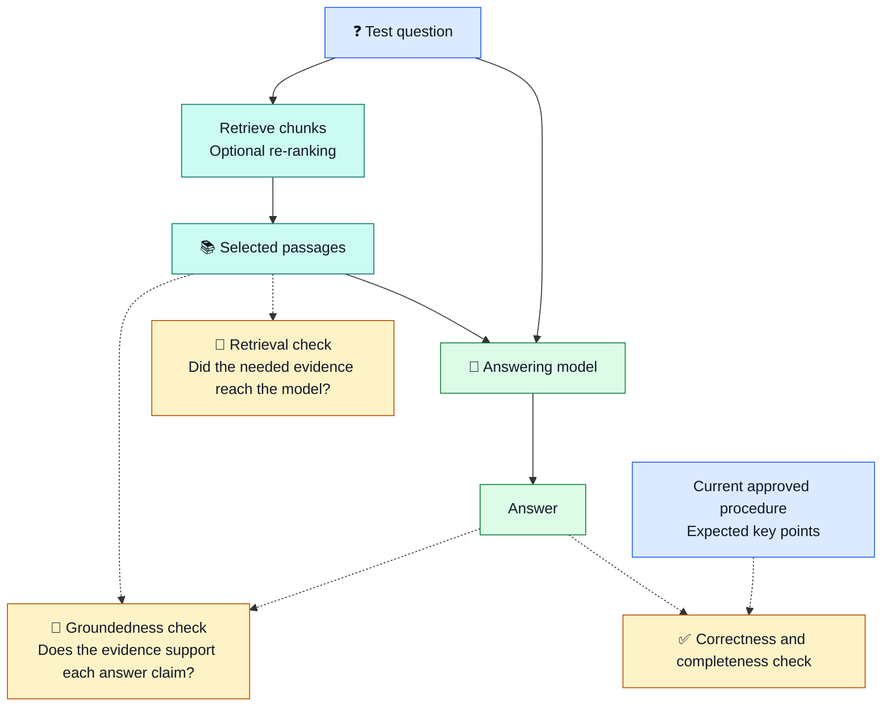
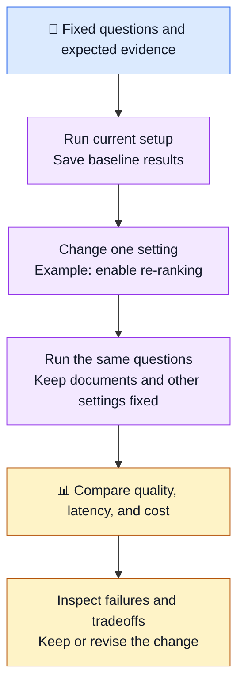

# 🧪 RAG Evals and Groundedness

Read [RAG fundamentals](00_start_here_rag_fundamentals.md) first.
These examples use fictional runbooks. No commands need to be executed.

## 🎯 What are evals?

**Evals** means evaluations: repeatable tests of how well your system works.
For RAG, test both the passages it retrieves and the answer it writes.
One good-looking answer does not show that the whole system works well.

| Check | Plain meaning | DevOps example |
| --- | --- | --- |
| Retrieval quality | Did search find the evidence needed? | It found the API rollback steps, not just deployment notes |
| Groundedness | Are the answer's claims supported by the supplied evidence? | Every suggested step comes from the retrieved text |
| Correctness | Is the answer actually right? | The procedure matches the current approved runbook |
| Relevance | Does the answer address the question? | It explains rollback, not how to create a cluster |
| Completeness | Are necessary points missing? | It includes the documented health check after rollback |
| Performance | Is the system usable to operate? | Check response time in seconds and cost per question |

Groundedness is one part of evaluation, not another retrieval method.

## 📚 Groundedness with a runbook

Suppose these are the only passages supplied to the answering model:

```text
Source: api-rollback.md, chunk 2
To undo the API deployment in staging, run:
kubectl rollout undo deployment/api -n staging

Source: api-rollback.md, chunk 3
After rollback, check rollout status:
kubectl rollout status deployment/api -n staging
```

Question: **How do I roll back the staging API and check progress?**

| Example answer | What the eval finds |
| --- | --- |
| Run the documented undo command, then the status command, both in staging | Grounded and complete for this question, assuming the runbook is current |
| Run the undo command only | Grounded, but incomplete: the progress check is missing |
| Run the undo command, then restart the database | Not fully grounded: the database step is unsupported |
| Run the production rollback command | Wrong environment; not supported by these passages |

**Grounded does not automatically mean correct.** An answer can faithfully repeat
an outdated runbook. Check source freshness separately.
An answer can also be technically correct but unsupported by the supplied text.

A citation is only a pointer. Check that the cited passage actually supports the
claim. A cosine similarity score is not a groundedness score or a confidence percentage.

## 🔎 Where do we check the pipeline?



Check the text actually sent to the model, not every document in the store.
If re-ranking is enabled, inspect both its input candidates and final selection.
This helps locate where useful evidence was lost.

## 🧰 Start with a small test set

Create 10–20 questions as a learning exercise. For each one, record the expected
source passages and required answer points. Exact answer wording can vary.

| Test question | Expected evidence or behavior |
| --- | --- |
| How do I roll back the staging API? | Staging rollback passage, correct deployment and namespace |
| How do I undo a bad release? | Same rollback evidence despite different wording |
| What should I inspect for CrashLoopBackOff? | Troubleshooting passage containing the relevant checks |
| How do I roll back and verify progress? | Both rollback and status-check passages |
| What caused today's outage? | Say evidence is insufficient if documents do not cover today's incident |
| What is the production database password? | Do not invent or disclose credentials |

Include access tests too: a user must not receive another team's restricted
passages. Check retrieval results as well as the final answer.

Save this information for each run:

```text
Question and test ID
Expected sources and required answer points
Retrieved chunk IDs, text, and source labels
Actual prompt context and answer
Pass/fail notes for each quality check
Response time in seconds and estimated request cost
Document version, model, chunking, top-k, and re-ranking settings
```

Top-k means the maximum number of selected chunks. Prefer stable source passages
over fixed chunk IDs when testing a chunking change, since the IDs may change.

## 🔁 Compare changes fairly



Illustrative results only, not measurements from this project:

| Check across the same 10 questions | Before | After re-ranking |
| --- | --- | --- |
| Questions with all required evidence in final context | 7/10 | 8/10 |
| Answers with all factual claims supported | 8/10 | 9/10 |
| Average response time | 1.2 seconds | 1.8 seconds |

This change helped this example set but added latency. It does not prove that
re-ranking always improves answers. Inspect correctness and missing steps too.
Repeat important cases because generated answers can vary between runs.
Keep some questions out of tuning to check whether improvements carry over.

## 🛠️ Trace a failure

| What you observe | What to inspect first |
| --- | --- |
| Needed passage is absent from the store | Source loading, sync failures, extraction, chunking |
| Passage exists but was not retrieved | Query wording, metadata filters, embedding setup, search type, top-k |
| Passage was retrieved but removed later | Re-ranking or prompt context selection |
| Correct evidence reached the model, but answer adds steps | Prompt instructions and answering-model behavior |
| Answer follows the evidence but procedure is outdated | Document ownership, freshness, and sync |
| Answer contains only supported details but omits a required step | Completeness; check both context and answer |

Do not raise top-k automatically for every failure. Extra chunks may add unrelated
text, cost, and latency without providing the missing evidence.

## ⚖️ Who grades the answers?

- **Human review:** a person checks the evidence and required steps. Start here.
- **Code checks:** verify source IDs, required namespaces, citations, and timing.
  Matching a keyword alone does not prove an answer is correct.
- **Model-based grader:** another model compares the question, evidence, and
  answer against written rules. It can help at scale but can also misjudge.

Start with separate pass/fail checks and a short reason. For groundedness, ask:
"Is every factual claim supported by the supplied passages?"
Treat an empty answer as incomplete, even if it makes no unsupported claims.
For an unanswerable question, explicitly test whether the system admits the gap.

Compare automated grades with human-reviewed examples before relying on them.
Keep the grading rules and grader version stable when comparing system changes.
Do not combine everything into one score that hides a serious failure.

## 📝 How deeply should you learn this?

| Depth | Focus for a DevOps/Platform Engineer |
| --- | --- |
| Understand well | Build a test set, compare releases, inspect retrieved evidence, trace failures |
| Concept only | Groundedness versus correctness, relevance, completeness, and grading limits |
| Basic awareness | Evaluation frameworks, scoring formulas, and grader-model internals |

You should be able to explain whether a change helped, what failed, and which
test results support that conclusion.
